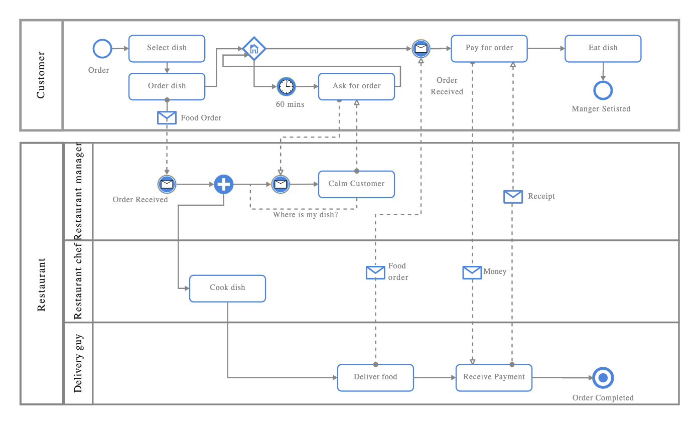

# Exercícios

## 1. Crie um quadro Kanban para adicionar cards em uma situação de ataque alienígena 👽🛸

| **Backlog** (Ideias/Pendências) | **A Fazer** (To Do) | **Em Andamento** (In Progress) | **Em Revisão** (Code Review) | **Concluído** (Done) |
|--------------------------------|---------------------|---------------------|---------------------|---------------------|
| Criar um plano de evacuação global 🌍 | Mobilizar forças militares mundiais 🚀 | Construir barreiras energéticas ao redor das cidades 🏙️⚡ | Testar nova tecnologia de armas de plasma 🔬 | Enviar mensagem de paz para os alienígenas 📡✅ |
| Desenvolver traje anti-radiação 👽☢ | Recrutar cientistas para desenvolver armas avançadas 🧪 | Lançar sondas para análise da frota alienígena 🛰️ | Revisar estratégia de contra-ataque 🔄 | Estabelecer comunicação com alienígenas pacíficos 🛸🤝 |
| Criar inteligência artificial para prever ataques 🤖 | Construir bunkers subterrâneos 🏗️ | Hackear sistemas alienígenas para obter informações 💻🛸 | Analisar padrões de ataque dos invasores 📊 | Salvar o presidente dos EUA (de novo) 🇺🇸😂✅ |
| Criar um super robô gigante para combate 🤖🔥 | Desenvolver vacina contra possíveis vírus alienígenas 🦠 | Montar equipe de pilotos para naves de combate 🛩️ | Aprovar código de defesa intergaláctico 🌌📜 | Organizar um grupo de resistência global 🌍✊✅ |

## 2. Crie um BPMN para o processo de pedido de um lanche no iFood

### 1️⃣ Ator Principal: Cliente
1. **Acessa o aplicativo do iFood** 📱  
2. **Escolhe um restaurante** 🍔  
3. **Seleciona os itens do pedido** 🛒  
4. **Revisa o pedido e adiciona observações** (exemplo: "sem cebola") 🔍  
5. **Escolhe a forma de pagamento** 💳💰  
6. **Confirma o pedido** ✅  

### 2️⃣ Ator: Sistema do iFood
7. **Notifica o restaurante sobre o novo pedido** 🔔  
8. **Confirmação automática do pagamento** 💲  

### 3️⃣ Ator: Restaurante
9. **Recebe o pedido e aceita** 👨‍🍳  
10. **Prepara o lanche** 🍔🔥  
11. **Finaliza o pedido e embala para entrega** 📦  

### 4️⃣ Ator: Entregador
12. **Recebe notificação para retirada do pedido** 📩  
13. **Vai até o restaurante e pega o pedido** 🏍️  
14. **Inicia o trajeto de entrega** 🚀  

### 5️⃣ Ator: Cliente
15. **Recebe notificação de que o pedido está a caminho** 📲  
16. **Acompanha a entrega em tempo real** 🗺️  
17. **Recebe o pedido do entregador** 🙌  
18. **Avalia o pedido e o entregador** ⭐⭐⭐⭐⭐  

>Com esse fluxo, é possível **identificar gargalos**, como atrasos no preparo ou na entrega, e **otimizar o processo** para melhorar a experiência do usuário!  