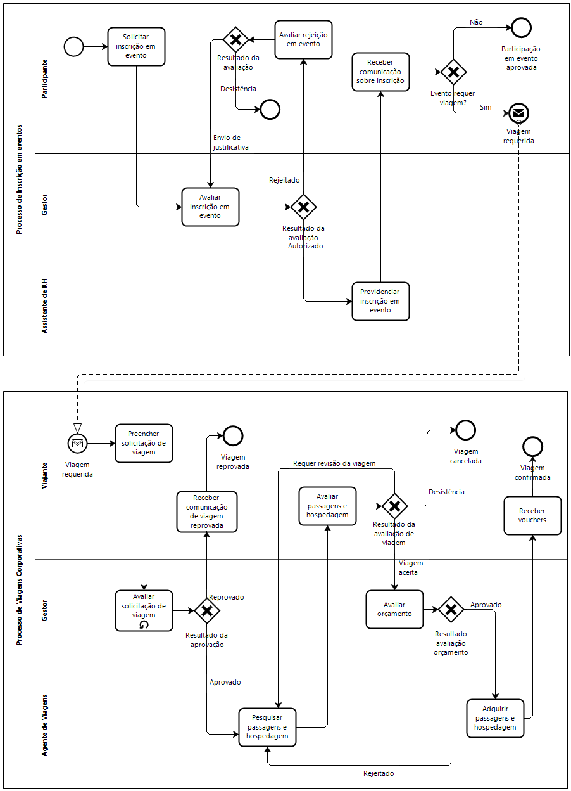

# Gestão por Processos e BPMN

>"Você já teve que resolver um problema que envolvia várias pessoas e tarefas? Como organizar isso para que não vire uma bagunça danada?"

**Contextualização:**  
- Empresas funcionam como **conjuntos de processos** interligados.  
- Melhorar esses processos **aumenta eficiência, reduz custos e melhora a experiência do cliente**.  
- Exemplos práticos:
  - **Fast food**: Do pedido à entrega, cada etapa é um processo bem definido.  
  - **E-commerce**: Da compra no site até a entrega, há diversos processos funcionando em conjunto.  
  - **TI**: No suporte técnico, um **chamado** pode passar por várias etapas antes de ser resolvido.

## Gestão por Processos
**O que é Gestão por Processos?**  
- `Foco na eficiência dos fluxos de trabalho` em vez de funções isoladas.  
- Objetivo: **otimizar processos, reduzir desperdícios e melhorar resultados**.  

**Exemplo 1:**  
- **Montadora de carros**: Cada setor (produção, estoque, vendas) precisa estar alinhado para o carro ser fabricado no prazo certo.  
- **Empresa de TI**: O desenvolvimento de software envolve `requisitos, design, codificação, testes e implantação`, exigindo integração entre equipes (Engenharia de Software). 

**Exemplo 2:**  
- **Suporte ao cliente em uma empresa de tecnologia**:
  1. Cliente abre um chamado.  
  2. O time de suporte analisa e tenta resolver.  
  3. Se necessário, o problema é escalado para o time de desenvolvimento.  
  4. Após a solução, o cliente recebe feedback e avaliação do atendimento.  

>**Conclusão:** Empresas **eficientes** otimizam processos constantemente para melhorar produtividade.

## Processos de Negócios
**O que são Processos de Negócios?**  
- **Conjunto de atividades estruturadas** que geram valor para a empresa e clientes.  
- **Tipos de processos**:
  1. **Primários** – Relacionados diretamente com clientes (ex: venda de um produto).  
  2. **De suporte** – Ajudam na execução dos primários (ex: RH, TI, financeiro).  
  3. **De gerenciamento** – Controlam e otimizam os demais (ex: auditoria, governança).  

**Exemplo: Atendimento em um hospital**:
  1. Paciente faz check-in.  
  2. É encaminhado ao médico.  
  3. O médico solicita exames.  
  4. O paciente faz exames e retorna para diagnóstico.  
  5. O tratamento é iniciado.  
  6. ~~O paciente morre.~~

**Exemplo: Implantação de um novo sistema em uma empresa**:
  1. O cliente solicita um sistema.  
  2. O time de análise levanta requisitos.  
  3. O desenvolvimento cria e testa a solução.  
  4. O cliente aprova e o sistema entra em produção.  
  5. O suporte assume o atendimento pós-implantação.  

>**Conclusão:** Empresas mapeiam e ajustam processos para **reduzir custos e aumentar a satisfação do cliente**.

## Business Process Modeling Notation (BPMN)
**O que é BPMN?**  
- **Padrão gráfico** usado para modelar processos de negócios de forma clara e padronizada.  
- Ajuda a **visualizar fluxos de trabalho** e entender como tarefas estão conectadas.  

**Elementos principais do BPMN:**
1. **Eventos** (círculos) – Início, intermediário e fim de um processo.  
2. **Atividades** (retângulos) – Tarefas ou ações dentro do processo.  
3. **Fluxos de sequência** (setas) – Ligam os elementos e mostram a ordem das atividades.  
4. **Decisões (Gateway)** (losangos) – Definem caminhos alternativos.  
5. **Piscinas e raias (Swimlanes)** – Representam diferentes áreas ou responsáveis. 

Exemplo simples:

Exemplo mais complexo:

>**Conclusão:** BPMN **torna os processos visíveis, compreensíveis e otimizáveis**.
 
## Ferramentas para modelar usando BPMN
Bizagi Modeler, Camunda, Lucidchart, Miro, Microsoft Visio, Draw.io.
